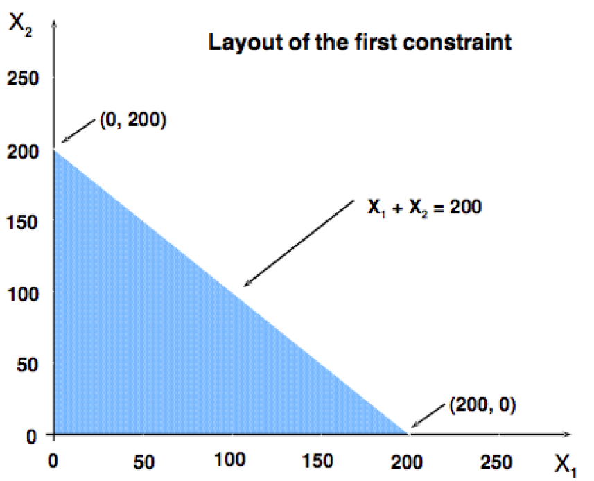
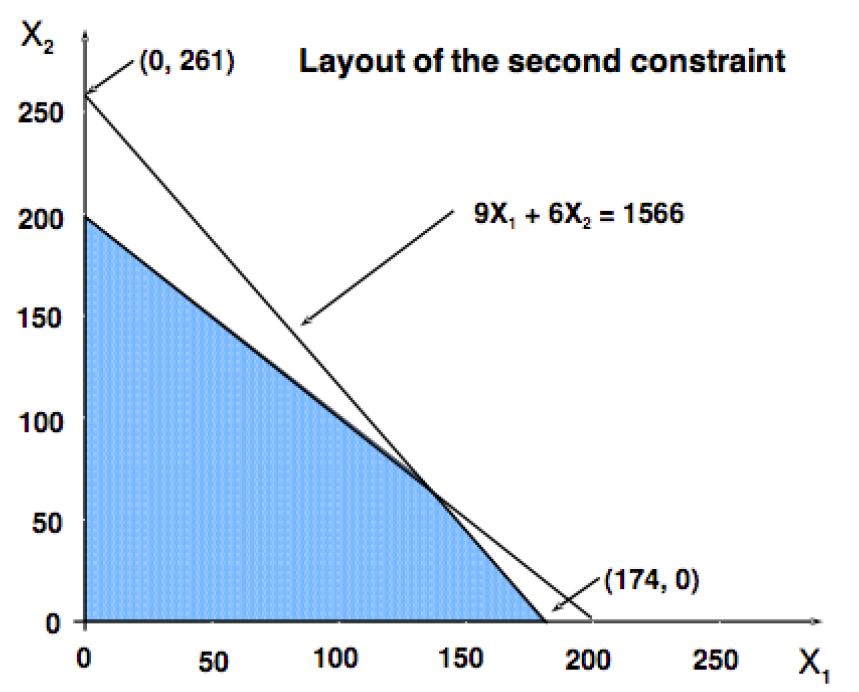
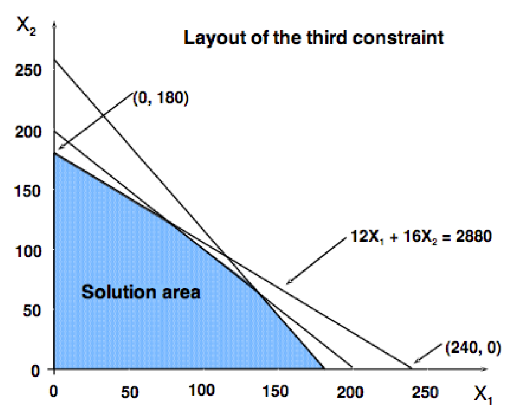
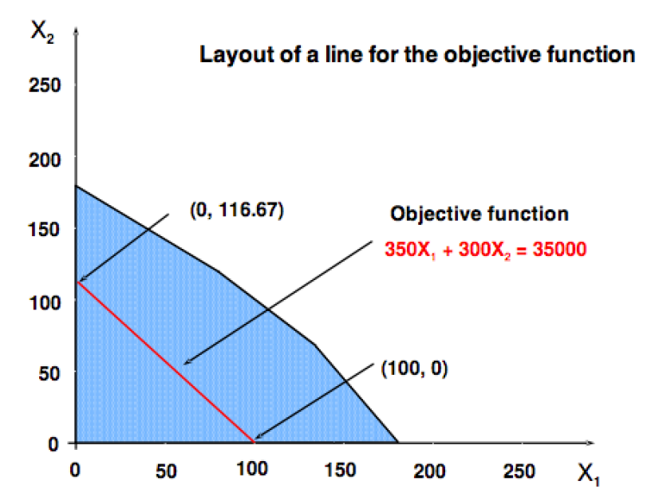
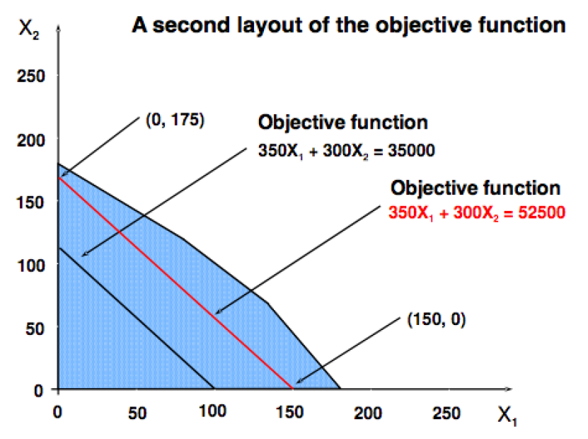
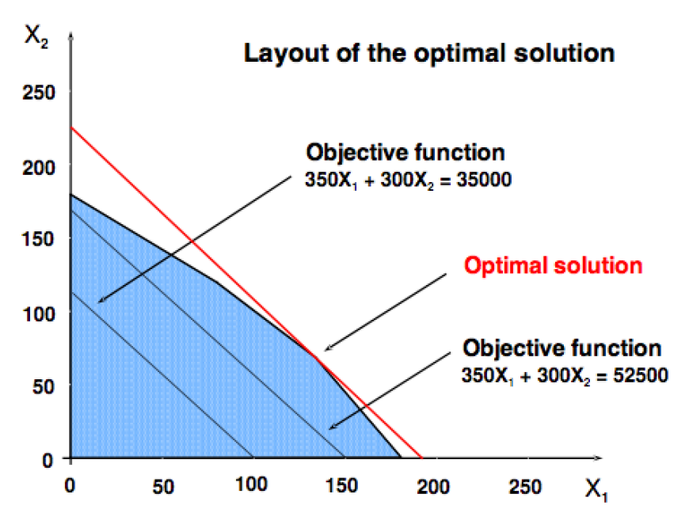
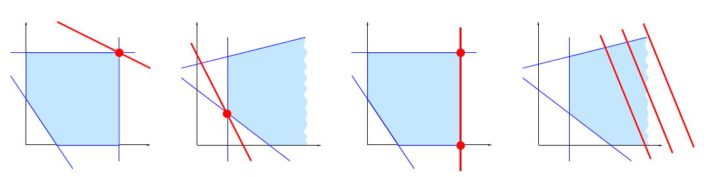

# Objetives  {.tabset .tabset-fade .tabset-pills}

* Conceptually describe in what situations the linear programming method can be applied, and what this quantitative tool consists of.

* Describe the general steps to follow in solving linear programming problems.

* Determine the practical elements necessary to implement a solution with the linear programming method.

---

# **Motivating case study**

> **A resource allocation problem**

A company produces copper cable of 5 and 10 mm of diameter on *a
single production line* with the following constraints:

The production capacity of the company allows to produce up to 104.4 meters --under the assumtion of having a linear production line of both cables produced--. The company must produce 10mm diameter cable in a 60 percent proportion, with respect to the producion ot 5mm diameter cable.

Product distribution consideration allow the company to produce at most 200 meters of both types of cable combined, since it is now allowed to store the excedent of cable not distributed within the week.

Due to demand, the market can take up to 102.8571 meters of both types of cables, among which 42.85714 percent must be of 10 mm diameter cable, and 57.14286 percent of 5mm diameter cable.

Both cables are respectively sold at 350 and 200 EUR the meter.

> Question: **What amount of meters must the company produce of both types of cables in order to maximize its weekly revenue?**

## Some other examples

> Let us take a few minutes to formulate similar to the `motivating case study` based in our everyday life.

---

# Steps for **modelling in practice**

1. **Defining the Problem**

2. **Developing a Model**

3. **Acquiring Input Data**

4. **Developing a Solution**

5. **Testing the Solution**

6. **Analyzing the Results**

7. **Communicating the Solution and Results**

8. **Implementing the Results**

# Introduction to **optimization**

## Montivation

Why **linear programming** is a very important topic?

* A lot of problems can be formulated as linear programmes.

* Nowadays, here exist efficient methods to solve them -- or at least give good approximations--.

## What is a **linear programm**?

It is an *optimization problem* consisting in

a. maximizing (or minimizing) a `linear objective` function of $n$ decision variables

b. subject to a set of constraints expressed by linear equations or
inequalities.

## History

It was originated within a military context: 

> `programme` = `resource planning`

The terminology is due to *George B. Dantzig*, inventor of the Simplex
Algorithm (1947), developed during WWII and published right afterwards.

## Terminology

a. **Decision variables** are denoted by $x_1,x_2,\ldots,x_n$.

b. **Objetive function** mapping $\Re^n\rightarrow \Re$ in a linear way.

c. **Constraints** related to the $n$ decision variables. These constraints are typically expressed in the form of linear inequalities.

> The **optimization rule** consist in `maximizing (or minimizing)` the `objective function` with regards to the $n$ `decision variables` subject to the given constraints.

## Remarks

Recall that in **linear programming**:

a. Both `objetive function` & `constraints` **must all be linear**

b. Typically, `objetive variables` are all possitive.

c. If `objective variables` are integers, then the problem turns into **Integer Programme (IP)**, which is far more challenging.

---

# Example: **Motivating case study**

Lets consider **two decision variables**, 
* $x_1$ - meters of 10mm cable, and 
* $x_2$ - meters of 5mm cable, 

and an **objetvice function** given by 
$$
f(x_1,x_2)=350 x_1 + 300 x_2.
$$

> The **optimization rule** consists in *maximizing* $f(x_1,x_2)$, i.e. finding such that
$$
(x_1^*, x_2^*)
 = 
 \arg\max_{(x_1,x_2)\in \mathbb{R}^{2}} f(x_1,x_2),
$$
subjet to the follow collection of **constraints**:
\begin{eqnarray}
x_1 + x_2 & \leq & 200 \nonumber \\
0.6 x_1 + 0.4 x_2 & \leq & 104.4 \nonumber \\
0.4285714 x_1 + 0.5714286 x_2 & \leq & 102.8571 \nonumber \\
x_1 & \geq & 0 \nonumber \\
x_2 & \geq & 0. \nonumber
\end{eqnarray}

> Alternatively, the constrainst cabe expressed as follows:
\begin{eqnarray}
x_1 + x_2 & \leq & 200 \nonumber \\
9 x_1 + 6 x_2 & \leq & 1566 \nonumber \\
12 x_1 + 16 x_2 & \leq & 2880 \nonumber \\
x_1 & \geq & 0 \nonumber \\
x_2 & \geq & 0. \nonumber
\end{eqnarray}

## Graphical soluction

* The constraints of a linear programme define a zone of solutions.

* The best point of the zone corresponds to the optimal solution.

* For problem with 2 variables, easy to draw the zone of solutions and to find the optimal solution graphically.

### First constraint

\begin{eqnarray}
x_1 + x_2 & \leq & 200 \nonumber \\
\end{eqnarray}

### First + second constraint

\begin{eqnarray}
x_1 + x_2 & \leq & 200 \nonumber \\
9 x_1 + 6 x_2 & \leq & 1566 \nonumber \\
\end{eqnarray}

### First + second + third constraint

\begin{eqnarray}
x_1 + x_2 & \leq & 200 \nonumber \\
9 x_1 + 6 x_2 & \leq & 1566 \nonumber \\
12 x_1 + 16 x_2 & \leq & 2880 \nonumber \\
\end{eqnarray}

### Over imposing the `objetive function`

\begin{eqnarray}
f(x_1,x_2) = 350 x_1 + 300 x_2 & \leq & 200
\end{eqnarray}

### Optimal Solution
The **optimal solution** is reached at $52,500$

## Analytic solution

The computation of the optimal solution requires the **identification** of the intersection of the constraints, i.e.
\begin{eqnarray}
x_1+x_2 & = &  200 \nonumber \\
9x_1+6x_2 & = &  1566 \nonumber
\end{eqnarray}

Thus, we get that
\begin{eqnarray}
x^*_1 & = & 122 \nonumber \\
x^*_2 & = & 78, \nonumber
\end{eqnarray}
for which
$$
f(x^*_1,x^*_2) = 66,100.
$$

# Remarks

Optimal solutions to **linear programme** problems might turn into the follow types:

a. A **single** optimal solution.

b. An **infinite number** of optimal solution.

c. **No optimal** solution, at all.

> If an optimal solution exists, there is always a **corner point** optimal solution!

---

# **Solving** linear programmes

> I. The constraints of an LP give rise to a geometrical shape: a **polyhedron**.

> II. If we can determine **all the corner points** of the polyhedron, then we calculate the objective function at these points and take the best one as our optimal solution.

> III. The **Simplex Method** intelligently moves from corner to corner until it can prove that it has found the optimal solution.

## Notes

* Geometric method impossible in higher dimensions

* Algebraical methods: **Simplex method** skim through the feasible solution polytope. Similar to a "Gaussian elimination". Very good in practice, but can take an exponential time.

* Polynomial methods exist: **ellipsoid method**. But more theoretical than practical.

## Integer programme

* Feasible region: a set of discrete points.

* Corner point solution not assured.

* No "efficient" way to solve an IP.

* Solving it as an LP provides a relaxation and a bound on the solution.

# **Little-big-insignificant details**

## Difficulty: Large number of solutions.

* `Choose the best solution` among $2n$ or $n!$ possibilities: *all solutions cannot be enumerated*

* `Complexity of studied problems`: often NP-complete.

## Solving methods:

* Optimal solutions:

 - Graphical method (2 variables only).

 - Simplex method.

* Approximations:

 - Theory of duality (assert the quality of a solution).

 - Approximation algorithms.

---
---

# To be **remembered**

a. What is a linear programme.

b. The graphical method of resolution.

c. Linear programs can be solved efficiently (polynomial).

* **Why integer programs** are so harder (in general no polynomial algorithms). *In this case, we look for approximate solutions.*

# Steps for **modelling in practice**

1. **Defining the Problem**

2. **Developing a Model**

3. **Acquiring Input Data**

4. **Developing a Solution**

5. **Testing the Solution**

6. **Analyzing the Results**

7. **Communicating the Solution and Results**

8. **Implementing the Results**
