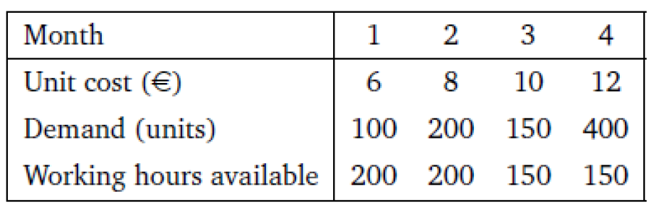
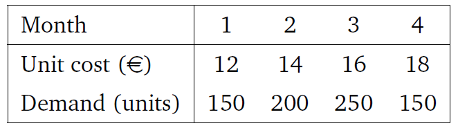
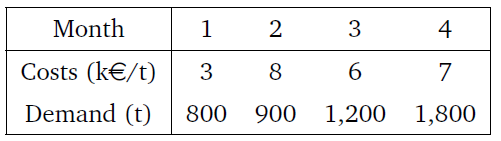
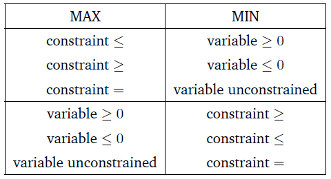

# Objetives  {.tabset .tabset-fade .tabset-pills}

* Pose and explain the dual of a linear programming problem.

* Describe and implement sensitivity analysis in a problem that involves the linear programming method.

* Identify and explain the typical situations that can be resolved using sensitivity analysis.

---

# Understanding the situation 

When working on the understanding of the problem(s) at hand, as one of Linear Programming, please, pay attention to **identify** in the context/description of the problem situation the following: 

a. Objective (or objectives)
b. Context/circumstances
c. Additional information not relevant.

The **identification of the objective** shall allow us to define:

a.1. `Decision rule`

a.2. `Domain Variables`

a.3. `The function to optimize`

On the other hand, the **identification of the context/circumstances** shall help us to define:

b.1. Identify the `number of restrictions`

b.2. Define `domain variables` involved

b.3. Address `specification/direction` of restrictions

b.4. Define `boundaries`.

---

---

# Case 1 (Cont.): A production plan with fixed costs

A manufacturing manager is in charge of minimizing the total costs (raw materials, labor and storage costs) of the following four months. In Table 3.1 can be found the cost of raw materials of one unit of final product, the demand of final product and the working hours available for each month. 

Labor costs are of 12 e per hour, and only worked hours are payed. Each unit of final product needs 30 minutes of labor.

Storage costs are equal to 2 e for each unit stored at the end of the month. Any unit produced at a given month can be used to cover the demand of the same month, or be stored to cover the demand of months to come. At the beginning of month 1 there is no stock, and there are no minimum stock requirements for any month.

## Objetives

> Define the decision variables (provide a brief definition of each set of defined variables), objective function and constraints of a linear programming model that minimizes total production costs. **Solved in a previous session.**

> Modify the model of the previous section if a fixed cost of 1,000 EUR has to be considered for each month that there is production. This cost is assumed only if there is production different from zero in that month.

---

# Case 2: A purchase plan with decreasing unit costs  {.tabset .tabset-fade .tabset-pills}

A manufacturing manager is in charge of minimizing the purchasing costs (raw materials plus storage costs) of the following four months.

In `Table 2` can be found the cost of one unit of raw material and the demand of raw material for each month. Storage costs are equal to 2 EUR for each unit stored at the end of the month. Any unit of raw material purchased at given month can be used to cover the demand of the same month, or be stored to cover the demand of months to come. At the beginning of month 1 there is no stock, and there are no minimum stock requirements for any month.

For the next four months, the supplier of raw materials has made an
special offer: 

> All units purchased above 200 in any given month will have a discounts of 2 EUR. For instance, if a purchase of 350 units is ordered in month 1, the first 200 units will be sold for 12 EUR each, and the following 150 will be sold for 10 EUR each.

## Case objective

> Define the decision variables (provide a brief definition of each set of defined variables), objective function and constraints of a linear programming model that minimizes total purchasing costs.

---

# Case 3: A production plan with extra capacity  {.tabset .tabset-fade .tabset-pills}

You are in charge of planning the production of a chemical product for the next four months. The monthly demand and the purchasing unit costs of raw material are listed in `Table 3`. The capacity of the plant is of 1,300 tonnes (t.) per month. 

The demand of a month can be covered with the production of the same month, and also with production of past months. The storage costs are of 2K EUR per tonne stocked at the end of the month. 

The stock of finished product at the beginning of the first month is of 200 T, and it is expected to hold the same quantity at the end of the fourth month. There are no stocks of raw material, so all stocks are of finished product.

## Objectives

> 1. Obtain the linear programming model that allows to obtain the production plan which minimizes the sum of production and storage costs.

> 2. What is the meaning of the dual variables of the constraints defined in the model?

As the demand is proven to be irregular, the plant management is considering the possibility of adding extra capacity to the plant, introducing a new shift. This new shift would increase plant capacity in 400 T per month, but also would include an extra fixed cost of 500K EUR. For legal reasons, it is not possible to add extra capacity in a month if it has been added in the previous month.

> 3. Modify the model obtained previously to include the possibility of including extra shifts, and assess the practicality of adding extra shifts.

---

# Case 4: Production of two models of chairs  {.tabset .tabset-fade .tabset-pills}

A company produces two models of chairs: `4P` and `3P`. The model `4P` needs 4 legs, 1 seat and 1 back. On the other hand, the model `3P` needs 3 legs and 1 seat. The company has a initial stock of 200 legs, 500 seats and 100 backs. If the company needs more legs, seats and backs, it can buy standard wood blocks, whose cost is 80 EUR per block. The company can produce 10 seats, 20 legs and 2 backs from a standard wood block.

The cost of producing the model `4P` is 30 EUR/chair, meanwhile the cost of the model `3P` is 40 EUR/chair. Finally, the company informs that the minimum number of chairs to produce is 1,000 units per month.

## Objectives

> 1. Define a linear programming model, which minimizes the total cost (the production costs of the two chairs, plus the buying of new wood blocks).

Due to the economic crisis, the company has considered the possibility to just producing a single chair model between `3P` and `4P`.

> 2. Define the new linear programming model for producing only a single chair model, which minimizes the total cost.

Finally, the new CEO (Chief Executive Officer) of the company has decided that the factory needs to produce of the model `4P` a minimum of 4 times the quantity of the model `3P`.

> 3. Define the new linear programming model, which minimizes the total cost when producing `4P` four times the quantity of `3P`.

---
---

# Duality concept

In a general (a.k.a. canonical) form, a *maximization linear programming model* can be formulated as
\begin{eqnarray}
\max f(\boldsymbol{x}) & = & \boldsymbol{c}'\boldsymbol{x} \nonumber \\ 
\text{s.t.}& & \boldsymbol{A}'\boldsymbol{x} \leq \boldsymbol{b} \nonumber \\
& & \boldsymbol{x}\geq 0.
\end{eqnarray}

The above problem can be expresses as a *minimization linear programming model* as:
\begin{eqnarray}
\min g(\boldsymbol{x}) & = & \boldsymbol{u}'\boldsymbol{x} \nonumber \\ 
\text{s.t.}& & \boldsymbol{u}'\boldsymbol{A} \leq \boldsymbol{c} \nonumber \\
& & \boldsymbol{u}\geq 0,
\end{eqnarray}
which is called the **dual** of the former *linear programming model*.

The association of directions in constraint components between and *original* (*primal*) and *dual* formulation are summarized in the next table.

## Example

Let us consider the linear programming model studied in the previous session:
\begin{eqnarray}
\max f(x_1,x_2) & = & 20 x_1 + 60 x_2 \nonumber \\
\text{s.t. a)} & & 30 x_1 + 20 x_2 \leq 2700 \nonumber \\ 
\text{b)} & & 5 x_1 + 10 x_2 \leq 850 \nonumber \\ 
\text{c)} & & x_1 + x_2 \geq 95 \nonumber \\
\text{d)} & & x_1,x_2 \geq 0. \nonumber \\ 
\end{eqnarray}

> This is called the *primal model*.

The *dual version* of this model is constructed in the following way:

* The `two domain variables` of the *primal* are turned into `three new domain variables` for the *dual* as follows: One `new domain` variable for each `conatraint function` (a)-(c).

* The `three new dowmain variables` are labeled as
  - $y_a$ for constraint (a)
  - $y_b$ for constraint (b)
  - $y_c$ for constraint (c)
  
* The *dual version* will have now instead `two constraints` (one for each `domain variable` attained to the *primal version*).

Thus, following **Table: Directions of *primal* and *dual* model formulation **, we get the *dual specification* of the *primal linear proframming model*:

\begin{eqnarray}
\min g(y_a,y_b, y_c) & = & 2700 y_a + 850 y_b + 95 y_c \nonumber \\
\text{s.t. 1)} & & 30 y_a + 5 y_b + y_c \geq 20 \nonumber \\ 
\text{2)} & & 20 y_a + 10 y_b + y_c \geq 60 \nonumber \\ 
\text{3)} & & y_a,y_b \geq 0 \text{ and } y_c \leq 0. \nonumber \\ 
\end{eqnarray}

## Properties

> I. The `dual` of a `dual linear programming model` corresponds to the `primal version`.

> II. Optimum of `primal` and `dual` are the same, when the `linear programming model` has a bounded optimum.

> III. 

